# 多功能聊天室 子项目：GUI实现

本项目为[多功能聊天室](https://github.com/wxq1999/versatile-chatroom)中的客户端GUI的实现

## 目标效果图

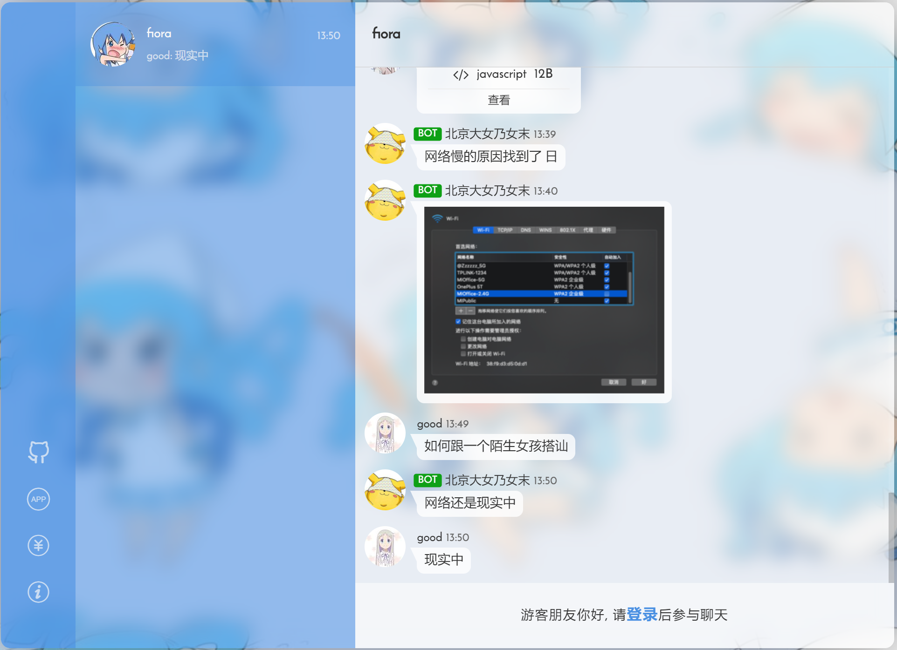

# 版本迭代

## version1.0

聊天页面

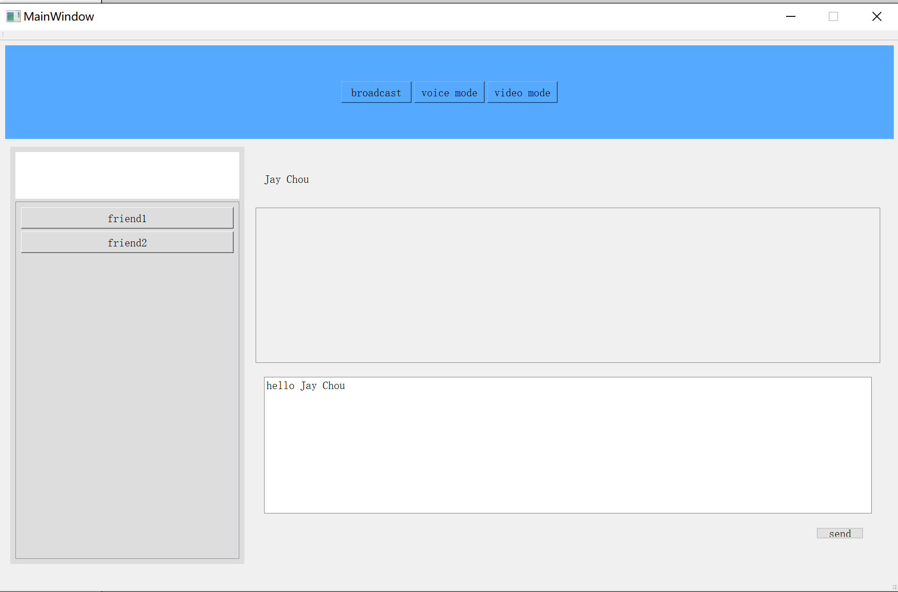

好友列表页面

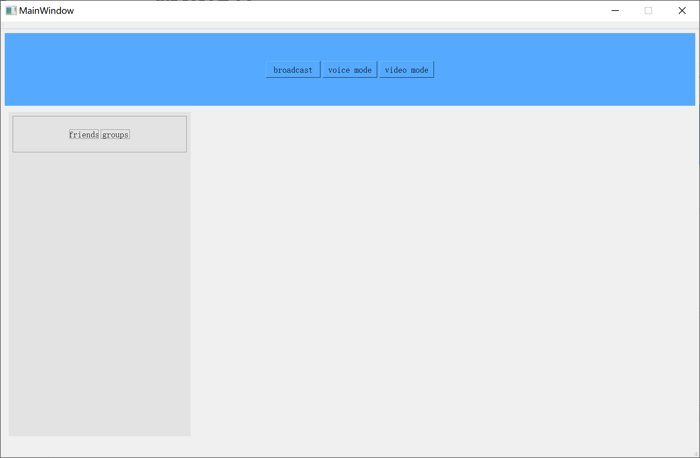

### 当前完成部分

目前完成了聊天界面和好友列表界面的基础框架。

聊天界面可在多个聊天窗口间切换。

预留页面给未来可能新增的功能。

### 近期待完成

1. 文件读取

暂时尝试将数据从文件中读取，如好友信息，聊天记录等。完善接口，便于数据库接入后直接使用。

2. 好友列表完善

从文件中读取好友列表后，在列表中显示。

构造列表类以及其下的好友项，**单击**选取好友后能在右侧看到好友基本信息。

3. 动态添加聊天窗口页

目前聊天窗口的数目在初始化后是固定的。

欲实现**双击**好友列表中的好友，聊天界面动态新添与该好友的聊天框或者跳转到已有聊天窗口。

鼠标**移入**聊天界面，右侧显示一个小的关闭按钮。**点击**该按钮，左侧栏撤销该好友选项，同时右侧聊天界面消失。

4. GUI美化

许多小细节，如边框、不同部分间的空隙都需要调整。

## version1.1

初步完成了登录和注册界面

登陆界面

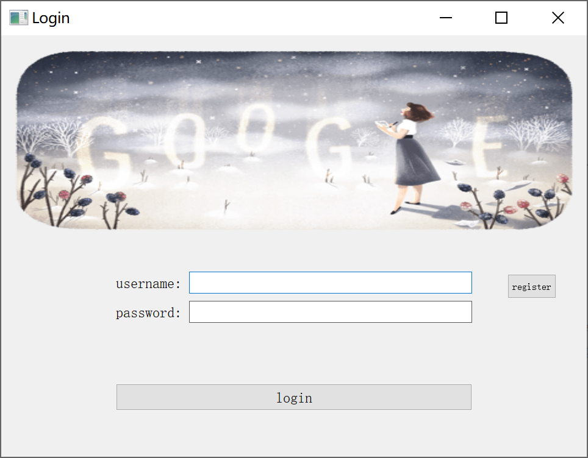

注册界面

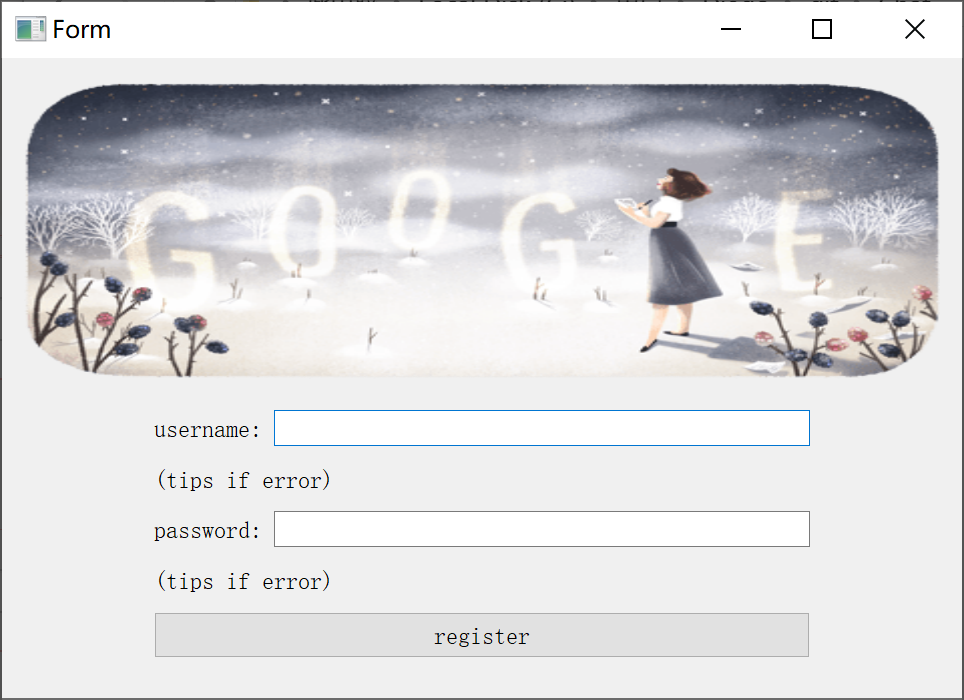

## version2.0

部分窗口重构，创建新的窗口基类，隐藏默认的窗口头部，设置了关闭和最小化的按钮，同时鼠标可以拖动这些窗口来改变窗口的位置，大部分可见的窗口类都继承于这个新基类。新登录界面：

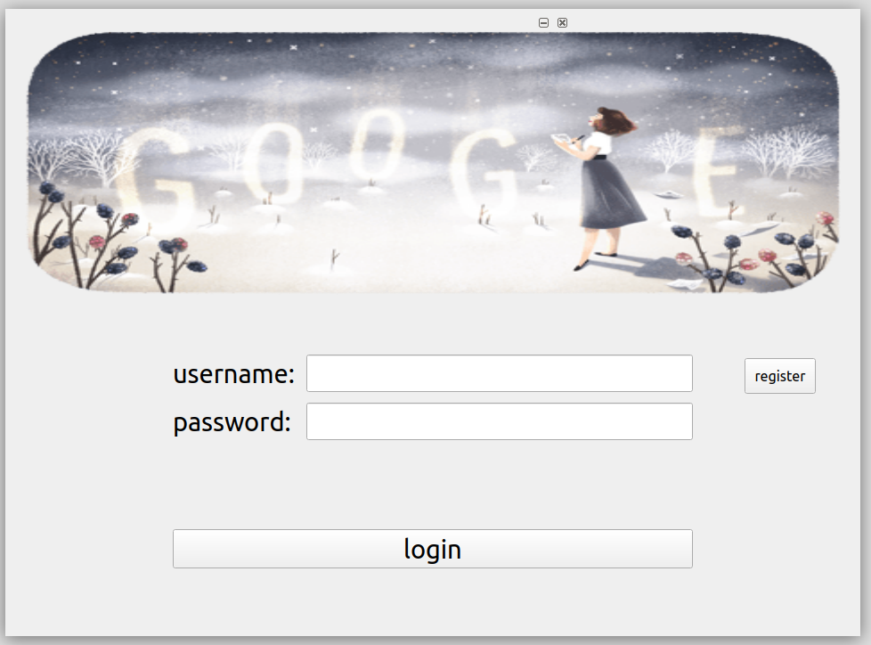

新注册界面：

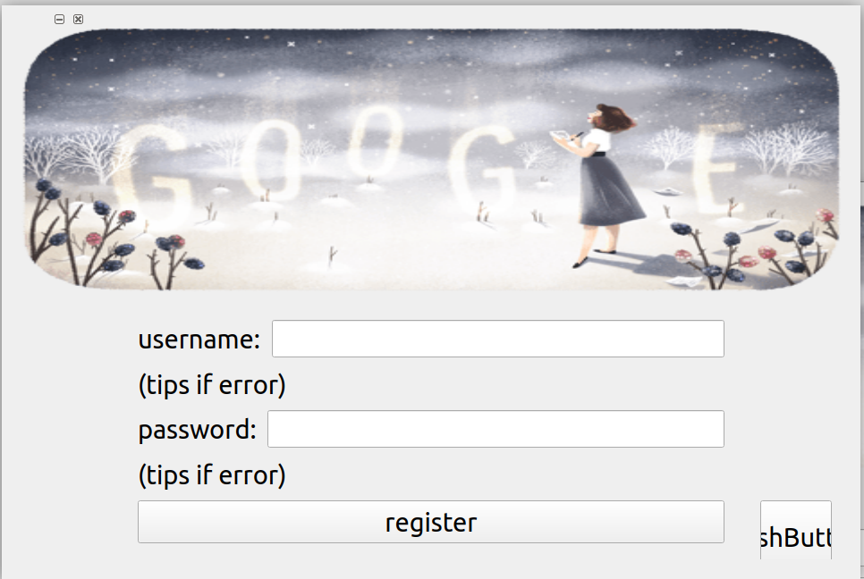

目前客户端服务器的功能暂未加入，所以点击登录按钮暂时设置成默认登陆成功。

主界面有三个页面：聊天页、好友/群列表页、最后一页留给可能之后添加的功能（也可能之后删除）

好友列表页如下

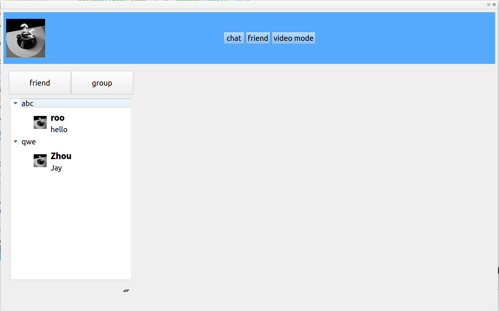

头像均设置为默认头像，之后如果连接服务器后可以更改，同时加载列表。这里的两个好友组和其下的两个好友群列表在初始化窗口时加入，用于测试。同时预留了添加好友/群组等功能的菜单按钮，如下图所示：

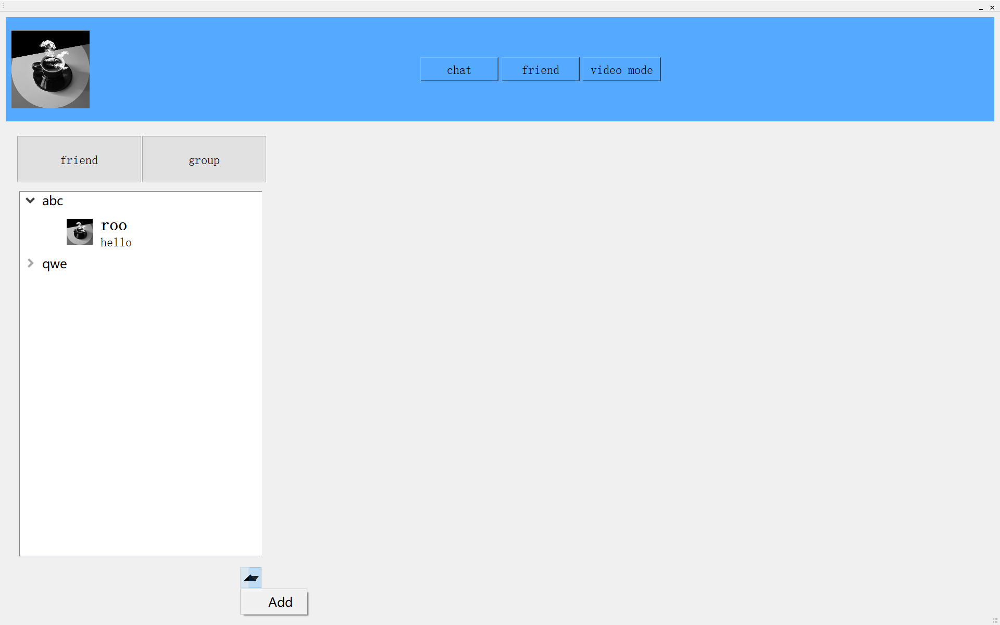

菜单功能待之后完善，目前只设置这样的接口。

聊天页初始如下

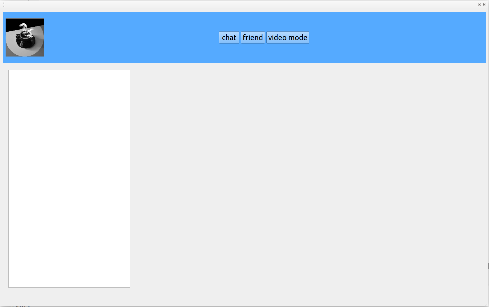

左侧为消息列表，右侧为聊天窗口。

当双击好友列表中的某个人后，如果消息列表中没有与这个人/群的来往消息，则将其加入到消息列表中。之后跳转至聊天页，聊天窗口显示对应的界面。双击一个好友，界面如下：

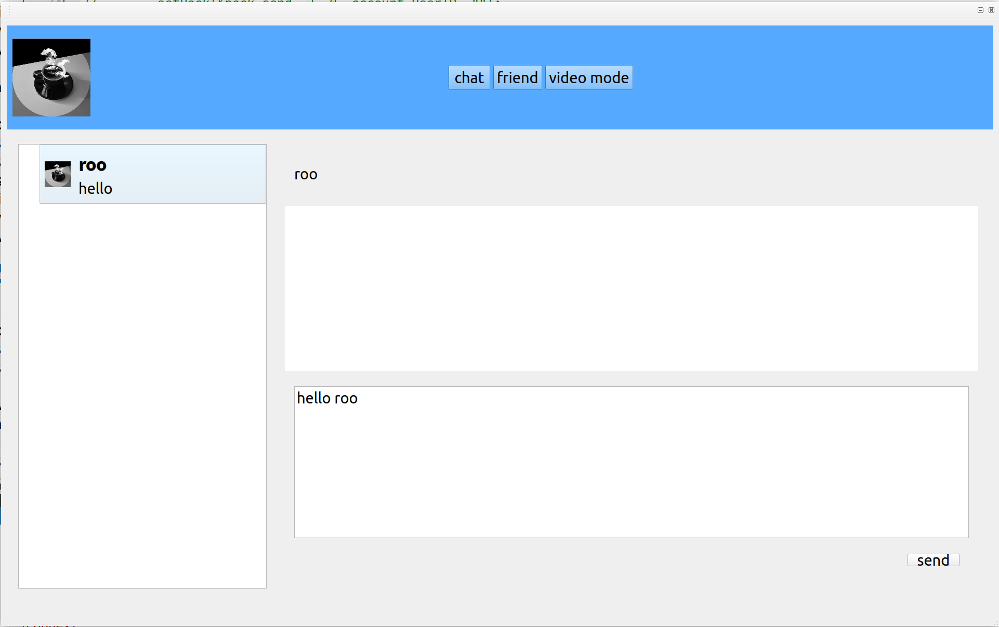

尝试发送消息：

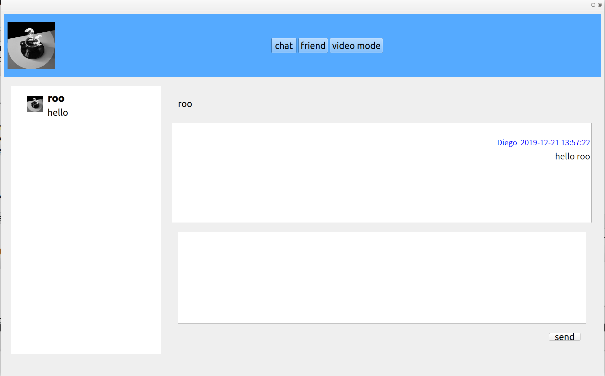

与另一个人聊天（双击好友列表中的条目）：

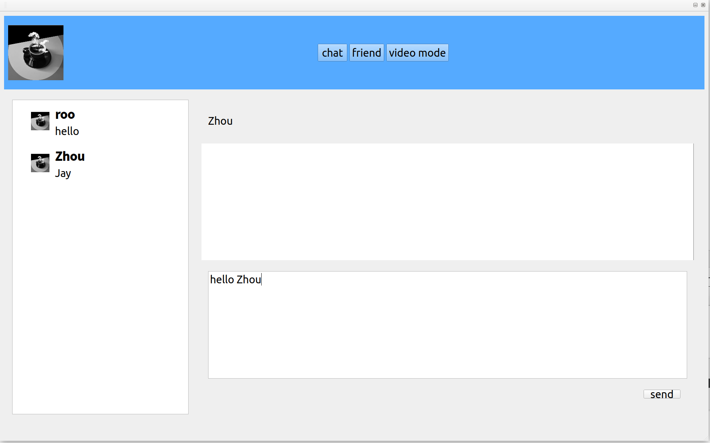

点击左侧消息条目可切换回去

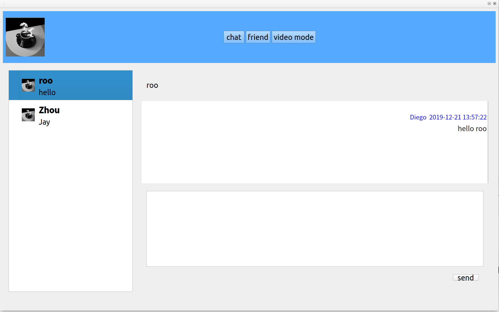

发送多条消息，出现滚动条：

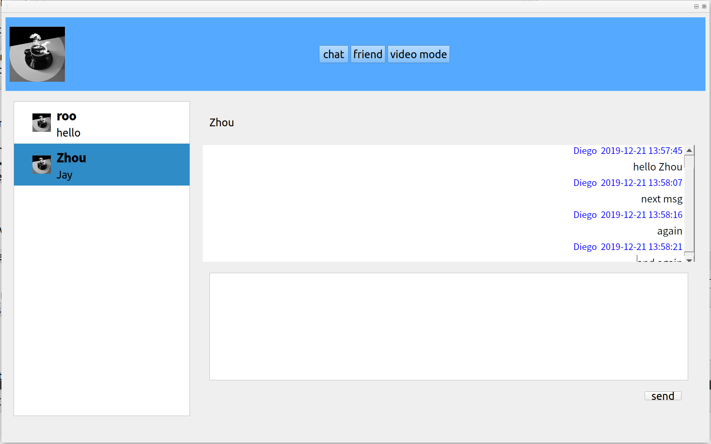

目前客户端GUI大致完成，但还有许多小细节待更改，如菜单按钮添加更多的功能，美化界面等等。其次，一些功能准备待服务器/客户端实现后再加，如登录/注册的验证过程，消息记录的加载。